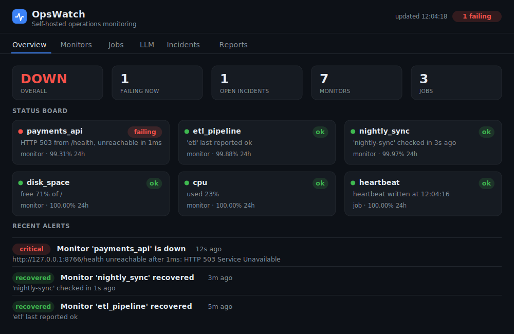
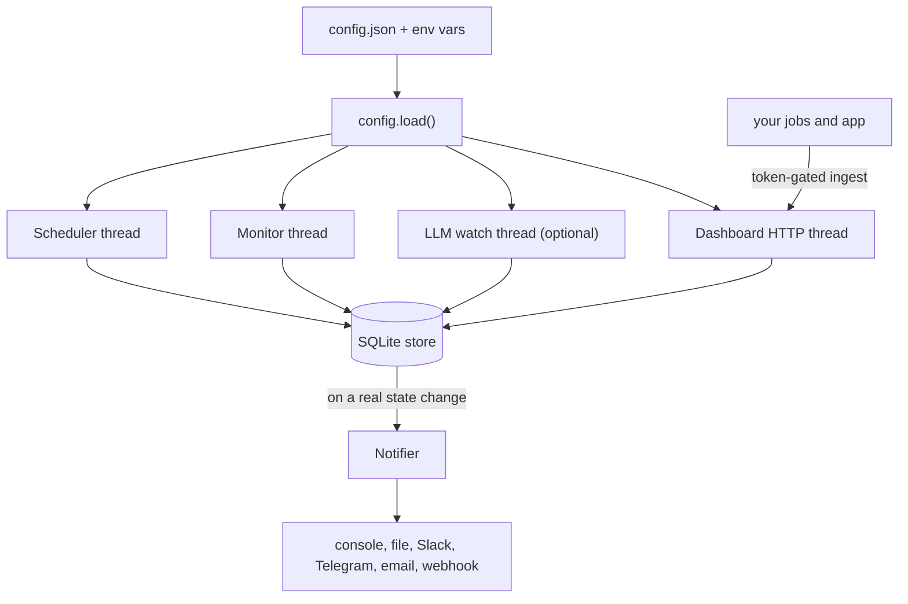
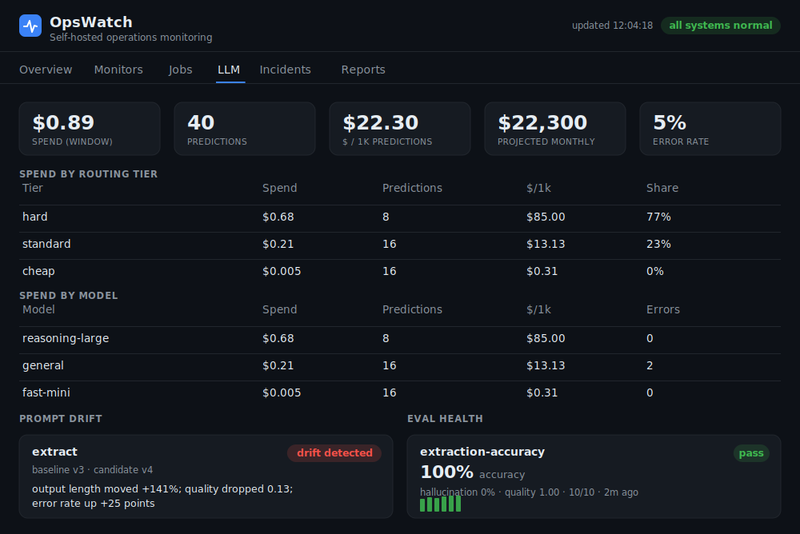

<h1 align="center">OpsWatch</h1>

<p align="center">
  <strong>A self-hosted automation monitoring and observability stack you run on your own server.</strong><br>
  It runs your jobs on a schedule, watches that everything keeps working, tracks what your AI<br>
  features cost, and alerts you the moment something breaks, so you find out before your customers do.
</p>

<p align="center">
  
  
  
  
  
</p>

OpsWatch is one small Python process you install on a Linux box. It schedules your jobs, monitors
the things that actually break, prices and grades the AI features you ship, and pages you on a state
change through the channels you already use. There is no SaaS subscription, no per-task billing, and
no third-party service in the loop: it is standard-library Python only, so it installs on a fresh
server with nothing but `python3` and keeps running on its own. Every label, color, and logo comes
from one config file, so the same install ships under any brand.

<p align="center">
  
</p>

## Run it in 60 seconds

No setup, no keys, nothing to sign up for:

```bash
git clone https://github.com/EdgeF-4/opswatch.git
cd opswatch
scripts/demo.sh
```

The demo starts the full stack on a throwaway database and drives a realistic incident: a monitored
API goes down, a data pipeline reports a failure, and a scheduled sync stops checking in. You watch
all three get caught, alert, and then clear, each one recorded as an incident that dents the uptime
number. It then seeds an hour of model traffic across the cheap, standard, and hard tiers, ships a
prompt change that drifts, and grades a labeled eval set, so the LLM panel shows live cost, a drift
flag, and eval health. Open the dashboard URL it prints to follow along live.

Prefer containers? `docker compose up --build` brings the stack up on
[http://127.0.0.1:8765](http://127.0.0.1:8765) with a live dashboard out of the box.

## Features

- **Scheduler** runs jobs on an interval or at a daily time, with retries and a full history of
  every run.
- **Six monitor types** that check the things that actually break:
  - `http` endpoint uptime, with status, body content, and a latency ceiling
  - `heartbeat` dead-man's switch: an external job checks in on its own schedule, and if it goes
    silent you hear about it
  - `webhook` failure: an external automation reports its own success or failure and the dashboard
    reflects it live
  - `resource` thresholds for disk, memory, CPU, and load average
  - `log_pattern` scanning for errors appearing in a log file
  - `job_freshness`, the check that catches a scheduled job which silently stopped running
- **Multi-channel alerting** to console, an append-only log file, Slack, Telegram, email, or any
  generic webhook. Alerts fire only on a state change (healthy to failing, and back), so you get one
  alert per incident, not a flood.
- **Uptime and SLA reporting** with time-weighted uptime across 24h, 7d, and 30d windows, incident
  counts, and mean time to recovery per target.
- **LLM observability** for any AI feature you run, alongside the infrastructure monitors:
  - dollar **cost** per call and per 1000 predictions, projected monthly spend at scale, broken
    down by model and by route
  - a **routing-tier** view so you see spend split across cheap, standard, and hard model tiers
  - prompt and version **drift** detection that flags when outputs or quality shift after a change
  - a labeled-dataset **eval harness** that scores accuracy and hallucination as a pass or fail
    with a trend
  - the same multi-channel **alerting** when cost spikes or an eval or drift crosses a threshold

  It is config-driven and provider-agnostic: it works with Claude or any OpenAI-compatible API, and
  no key is stored in the config or the repo.
- **A polished dashboard** with a status board, per-monitor history strips, an incident timeline, an
  SLA report, and an LLM panel, all on one self-contained page. No front-end build, no CDN, nothing
  external to load.
- **Optional built-in login** so the dashboard is safe to expose, and an optional token-gated ingest
  endpoint for the heartbeat and webhook monitors.
- **White-label theming**: brand name, logo, tagline, colors, and footer all come from the config,
  so the same install ships under any name.

## Architecture

OpsWatch is one process running a few loops over a shared SQLite store, plus a dashboard that reads
from it. State lives in SQLite, so a restart loses nothing.



The full design, module by module, is in [ARCHITECTURE.md](ARCHITECTURE.md).

## The dashboard

One self-contained page, themed from your config, with six views:

| View | What it shows |
|------|---------------|
| **Overview** | A status board of every job and monitor, headline KPIs, and a live alert feed. |
| **Monitors** | Each monitor with its rolling history strip and 24h uptime. |
| **Jobs** | Each scheduled job, its last run, and recent outcome. |
| **LLM** | Spend by tier, by model, and by route, prompt-drift cards, and eval health (shown only when LLM observability is on). |
| **Incidents** | The timeline of everything that has broken and recovered, with durations. |
| **Reports** | Time-weighted uptime and SLA per target across 24h, 7d, and 30d windows. |

<p align="center">
  
</p>

## Run it directly

```bash
cp config.example.json config.json
python3 -m opswatch --config config.json
# dashboard on http://127.0.0.1:8765
```

## Install on a VPS

```bash
sudo ./deploy/install.sh
```

That creates an unprivileged service user, installs the code under `/opt`, drops an editable config
at `/etc/opswatch/config.json`, and registers a `systemd` service that restarts on failure and
starts on boot. Logs and alerts stream to `journalctl -u opswatch -f`.

The dashboard binds to `127.0.0.1` only. Turn on the built-in login, put TLS and auth in front with
[`deploy/Caddyfile.example`](deploy/Caddyfile.example), or both.

## Run with Docker

```bash
docker compose up --build      # dashboard on http://127.0.0.1:8765
```

The image is standard-library Python with no third-party packages. It starts with a small
self-contained config so the dashboard is live immediately. To run your own jobs and monitors, copy
`config.example.json` to `config.json`, edit it, and uncomment the config volume in
[`docker-compose.yml`](docker-compose.yml). Alert-channel and ingest secrets are read from the
environment by name, never baked into the image.

## Configuration

Everything is one JSON file. See [`config.example.json`](config.example.json) for the full
reference. Jobs, monitors, channels, theme, and the report windows are all declarative.

```json
{
  "scheduler": {
    "jobs": [
      { "name": "nightly_backup", "kind": "command",
        "target": "/usr/local/bin/backup.sh", "daily_at": "02:30", "max_retries": 1 },
      { "name": "crm_sync", "kind": "command",
        "target": "python3 /opt/scripts/sync.py", "interval_seconds": 300 }
    ]
  },
  "monitors": {
    "checks": [
      { "name": "api_up", "type": "http", "url": "https://example.com/health",
        "contains": "ok", "max_latency_ms": 2000 },
      { "name": "disk", "type": "resource", "metric": "disk", "min_free_pct": 10 },
      { "name": "nightly_etl", "type": "heartbeat",
        "source": "nightly-etl", "max_age_seconds": 90000 }
    ]
  }
}
```

- **Job schedules:** `interval_seconds` (every N seconds) or `daily_at` ("HH:MM").
- **Job kinds:** `command` (any shell command) or `builtin` (a function shipped in
  `opswatch/jobs.py`).
- **Monitor types:** `http`, `heartbeat`, `webhook`, `resource` (disk, memory, cpu, load),
  `log_pattern`, and `job_freshness`.

### Notifications

Console and log-file channels are on by default. Add chat and email channels in the
`notifications.channels` list. Every secret is read from the environment by name, so nothing
sensitive lives in the config or the repo:

```bash
export OPSWATCH_SLACK_URL="https://hooks.slack.com/services/..."
export OPSWATCH_TELEGRAM_TOKEN="..."     export OPSWATCH_TELEGRAM_CHAT_ID="..."
export OPSWATCH_SMTP_PASSWORD="..."       # host/port/from/to live in the config
export OPSWATCH_WEBHOOK_URL="https://hooks.example.com/your/endpoint"
```

### Dashboard login

Set `dashboard.auth.enabled` to `true` and provide a password in the environment. A SHA-256 hash
works too if you prefer not to store the plaintext:

```bash
export OPSWATCH_DASHBOARD_PASSWORD="choose-a-strong-one"
```

### Pushing heartbeats and failures in

Turn on `ingest.enabled` and set a token. External jobs then post to the ingest endpoint, which
feeds the `heartbeat` and `webhook` monitors:

```bash
export OPSWATCH_INGEST_TOKEN="long-random-string"

# at the end of a cron job, prove it ran:
curl -fsS -X POST "$DASH/api/ingest" -H "X-OpsWatch-Token: $TOKEN" \
  -d '{"source": "nightly-etl", "status": "ok"}'

# or report a failure from a script's error path:
curl -fsS -X POST "$DASH/api/ingest" -H "X-OpsWatch-Token: $TOKEN" \
  -d '{"source": "nightly-etl", "status": "fail", "detail": "exit 1"}'
```

## LLM observability

Turn on the `llm` block in the config (off by default; see `config.example.json` for the full
reference). You declare a price book per model, which tier each model belongs to, the prompts to
track for drift, the eval suites to run, and the cost / drift / eval thresholds that raise an alert:

```json
{
  "llm": {
    "enabled": true,
    "cost_window_seconds": 3600,
    "scale_predictions_per_month": 1000000,
    "pricing": {
      "fast-mini":       { "input_per_million": 0.15, "output_per_million": 0.60, "tier": "cheap" },
      "general":         { "input_per_million": 3.00, "output_per_million": 15.00, "tier": "standard" },
      "reasoning-large": { "input_per_million": 15.00, "output_per_million": 75.00, "tier": "hard" }
    },
    "prompts": [ { "name": "extract", "baseline_version": "v3" } ],
    "eval_suites": [ { "name": "extraction-accuracy", "dataset": "datasets/extraction.json",
                       "min_accuracy": 0.85, "max_hallucination": 0.05 } ],
    "thresholds": { "cost_per_window_usd": 5.0, "projected_monthly_usd": 3000 }
  }
}
```

Your application reports each prediction to the token-gated ingest endpoint. The stack prices it
from your table (cost and tier are computed server-side) and the LLM panel fills in. The body is
provider-agnostic, the same shape whether the call went to Claude or an OpenAI-compatible API:

```bash
curl -fsS -X POST "$DASH/api/llm/ingest" -H "X-OpsWatch-Token: $TOKEN" \
  -d '{"model": "general", "route": "summarize", "prompt": "extract",
       "prompt_version": "v3", "input_tokens": 1500, "output_tokens": 350,
       "ok": true, "quality": 0.92}'
```

Run the eval harness against your labeled sets, which records a pass or fail and a trend (and exits
non-zero on a failure, so it doubles as a monitored job):

```bash
python3 -m opswatch.evalrun --config config.json            # all suites
python3 -m opswatch.evalrun --config config.json --suite extraction-accuracy
```

A dataset is a JSON list (or JSONL) of records with an `input` and an `expected` answer, optionally
a grounding `context` and an explicit `quality`. Predictions come from a `prediction` field already
on each record (offline replay, no key needed) or from a `predict(input)` callable you wire to your
own model.

## Deployment options

OpsWatch is open source and yours to run. If you would rather have it deployed, tuned, and watched
for you, I offer three tiers. The managed tiers fold the separate scheduler, monitoring, and
alerting subscriptions you are probably paying for now into one line.

| | **Deploy** | **Deploy + Managed** | **Fully Managed** |
|---|---|---|---|
| One-time setup | $2,400 | $4,800 | $9,500 |
| Monthly | none | $750/mo | $1,800/mo |
| Jobs and monitors | up to 5 jobs, 3 monitors | up to 10 jobs, 6 monitors | unlimited, built to fit |
| Notification channels | 2 | 2 | all you need |
| Runbook + walkthrough | yes | yes | yes |
| Monitoring + alert response | you run it | next business day | same business day, priority |
| Monthly tuning + changes | not included | up to 3 / mo | up to 10 / mo |
| Patching + security updates | not included | included | included |
| Custom job authoring | no | no | yes |
| White-label for resale | no | no | yes |

Deployed and working on your box within five business days, or you do not pay the final milestone.

## Extending it

- **Add a built-in job:** write a function returning `(exit_code, output)` and register it in
  `opswatch/jobs.py`.
- **Add a monitor type:** write a `check_*` function returning `(ok, detail)` and wire it into
  `MonitorRunner.run_check` in `opswatch/monitors.py`.
- **LLM modules:** cost and tier rollups live in `opswatch/llmcost.py`, drift in
  `opswatch/llmdrift.py`, the eval harness in `opswatch/llmeval.py`, and the price book, watch loop,
  and dashboard panel in `opswatch/llm.py`.

## Tests

```bash
python3 -m unittest discover -s tests
```

Every module has unit tests. Pure decision functions are tested directly; the dashboard, ingest,
and network-touching pieces run against throwaway loopback servers, so the suite is fast and
self-contained with no external dependencies.

## License

MIT. See [LICENSE](LICENSE).
